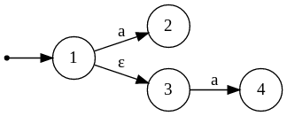
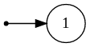
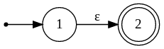
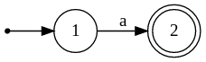

# Chapter 2: Regular languages

## Nondeterministic automata

NB: Go check *Computability and Complexity* notes. (Execution tree, etc.)

### $\epsilon$-NFA: $\epsilon$-Non Deterministic Finite State Automaton

For the example, we'll take this phrase: "A sequence of a's followed by a sequence of b's".

First, we can draw an automaton that accepts just a's, and then another that accepts just b's (by looping, one state). Then we have to reliate these 2 automaton but we have to put some character for the transition. So we put $\epsilon$ on the transition. This is also called a **spontaneous move**.

Some hidden non-determinisim can be done with $\epsilon$ like this:

**DEFINITION:** Definition of automaton: 5-tuple (*Computability and complexity*).

**DEFINITION:** Definition of Language $L(A)$ (*Computability and complexity*).

**PROPERTY:** DFA $\subseteq$ NFA $\subseteq$ $\epsilon$-NFA.

## Kleene's Theorem

**DEFINITION:** Every regular language is accepted by a DFA. For all $\epsilon$-NFA $A$: $L(A)$ is regular.

**PROOF:** The proof is done in 3 parts:
- 1. To each regular expression corresponds an $\epsilon$-NFA.
- 2. To each $\epsilon$-NFA corresponds a DFA.
- 3. To each DFA corresponds a Regular Expression.

So the three are equivalent.

**PROOF 1:** From regular expression to $\epsilon$-NFA.

|Regular expression|Automaton|
|----|--|
|$\varnothing$| |
|$\epsilon$| |
|$a$|  |
|$r_1+r_2$| We make the union of the automata by putting a new initial state that jumps to the initial state of $r_1$ and $r_2$ by $\epsilon$, same with the accepting states.|
|$r_1.r_2$| The concatenation of the 2 automata (with epsilons too). |
|$r^*$| We have to loop the automaton of $r$, jumping from the final state to the initial state, also jumping from the beginning to the end to skip it. |

## Practical information

First part of the project now (scanner). We'll be using the "Jflex" tool in Java to convert a Regular Language to a DFA.

"yacc" -> yet another compiler compiler

## Kleene's theorem (suite)

Example of RE $\to \epsilon$-NFA:

$l(l + d)^*$ (see how he did it in the notes).

**PROOF 2:** How to go from $\epsilon$-NFAs to DFAs.

The DFA will "simulate" all the possible behaviour of the $\epsilon$-NFA. See pages 44-45 from the notes.

**DEFINITION:** $\epsilon$-closure: Let $A = (Q,\Sigma,\delta,q_0,F)$ be an $\epsilon$-NFA. For all $i\in\mathbb{N}$, let $\epsilon-\mathbb{closure}^i(q)$ be defined as follows.

$\epsilon$-closure $^i(q)$ $=$ $\{q\}$ if $i = 0$, else $\delta(\epsilon$-closure $^{i-1}(q),\epsilon) \cup \epsilon$closure $^{i-1} (q)$.

So we can define $\epsilon$-closure $(q) = \bigcup_{i\geq 0} \epsilon$-closure $^i(q)$

Now that $\epsilon$-closure is defined, we can continue with the proof from $\epsilon$-NFAs to DFAs. So to construct:

- Set of states of the DFA = all subsets of states of the NFA

**DEFINITION:** Given a $\epsilon$-NFA $(Q^A, \Sigma, \delta^A, q_o^A, F^A)$, there is a DFA $(Q^D, \Sigma, \delta^D, q_0^D, F^D)$
- $Q^D=2^{Q^A}$
- $q_0^D = \epsilon$-closure $(q_0^A)$
- $F^D=\{S\in Q^D\ |\ S\ \cap F^A \neq \varnothing\}$
- $\forall S \in Q^D, \forall a\in \Sigma: \delta^D(S,a) = \epsilon$-closure $(\delta^A (S,a))$

**NOTE:** For the end of this session, Geeraerts explained pages 46-50, read them.
